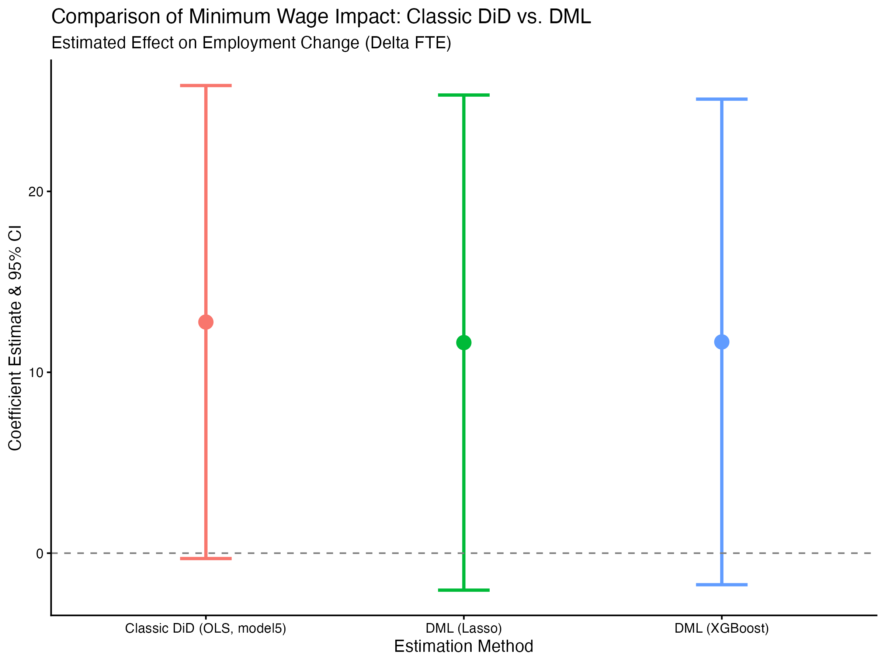
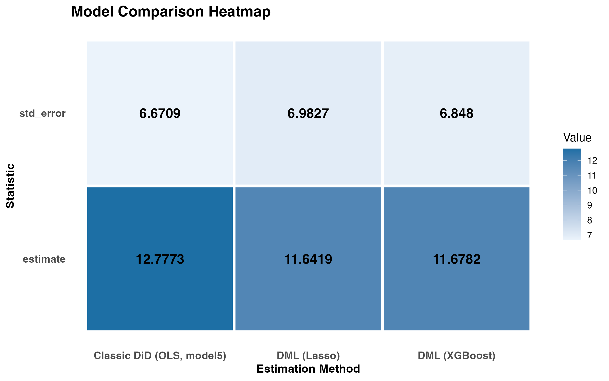

# Card & Krueger Replication: Classic DiD vs. Double Machine Learning

**Authors:** Jonggil Lee and Jongju Lee

Using the original Card & Krueger (1994) survey of NJ and PA fast-food restaurants around New Jersey's 1992 minimum wage increase, this project asks whether the classic difference-in-differences estimate of the employment effect holds up once we swap out ordinary least squares for a more flexible, machine-learning-based estimator.

## Motivation

Card & Krueger's NJ-PA fast-food study has been replicated more times than almost any other paper in labor economics, so reproducing the original numbers isn't really the interesting part anymore. What's more useful to check is whether the result holds up when the estimation method changes, not just the data.

Card & Krueger's original finding, that raising the minimum wage didn't cost jobs and if anything nudged employment up slightly, was controversial partly because it came from a fairly simple linear regression. If that result depended heavily on functional form (a linear model, specific controls), a more flexible estimator might tell a different story.

That's what we wanted to check here. We estimate the same effect two ways: a classic OLS difference-in-differences (matching the original paper's approach), and a double/debiased machine learning (DML) estimator that lets Lasso and XGBoost flexibly model the relationship between the covariates and both the treatment (the wage gap) and the outcome (employment change), then partials that out before estimating the effect. If both approaches land in the same place, that's real evidence the original result isn't an artifact of the linear specification.

The two approaches, side by side:

```
ΔFTE = α + β(gap) + ε                    (classic DiD, OLS)

Ỹ = Y − E[Y|X],  D̃ = D − E[D|X]          (Robinson (1988) partialling-out)
Ỹ = θ(D̃) + ε                             (DML: θ estimated via cross-fitted ML for E[Y|X], E[D|X])
```

This started as a basic classic-DiD replication of Card & Krueger's NJ vs. PA fast-food employment study. Everything after that (the robustness check, the DML estimation, and the final comparison) we built together.

## Key Results

**Classic DiD vs. DML: gap coefficient**

| Method | Estimate | SE | 95% CI |
|---|---|---|---|
| Classic DiD (OLS, region-controlled) | 12.78 | 6.67 | (-0.30, 25.85) |
| DML (Lasso) | 11.64 | 6.98 | (-2.04, 25.33) |
| DML (XGBoost) | 11.68 | 6.85 | (-1.74, 25.10) |

**NJ vs. PA employment change (for reference, the original Card-Krueger comparison)**

| | PA | NJ | NJ − PA |
|---|---|---|---|
| FTE before | 23.33 (SE 1.35) | 20.44 (SE 0.51) | -2.89 (SE 1.44) |
| FTE after | 21.17 (SE 0.94) | 21.03 (SE 0.52) | -0.14 (SE 1.08) |
| Change | -2.17 | +0.59 | **+2.75 (SE 1.80)** |

**Interpretation**

The first table is really this project's own contribution. Classic DiD, DML with Lasso, and DML with XGBoost all land within about one point of each other (12.78, 11.64, 11.68), and all three standard errors are close too (6.67 to 6.98). Swapping a linear model for two very different flexible ML methods barely moved the estimate at all, though it's worth flagging that the two approaches also run on slightly different samples (see Limitations). That's a meaningful robustness check: if the OLS result had been an artifact of assuming a linear relationship between the covariates and the outcome, we'd have expected Lasso or XGBoost to pull the estimate somewhere else. They didn't.

None of the three estimates are statistically distinguishable from zero at conventional levels (every 95% CI crosses 0), so we can't rule out a true effect of zero either. What we can say is that however you slice it, whether with a simple regression or with cross-fitted machine learning, the point estimate keeps landing in the same positive, not-negative territory. Adding region controls (Table 5) is also worth flagging: it pulled the classic DiD estimate down from 16.36 to 12.78, a bigger move than switching estimation methods did, which suggests region matters more here than model flexibility does.

The second table is just the baseline the comparison above rests on, and it reproduces Card & Krueger's headline result almost exactly: PA lost jobs (-2.17 average FTE) after the law took effect, while NJ actually gained a bit (+0.59), for a NJ-PA gap of +2.75. It's the well-known finding, included here mainly to confirm the replication is sound before trusting the method comparison built on top of it.

## Limitations & Future Direction

Sample size and missing data: the primary estimation sample only keeps stores with complete FTE and wage data in both waves (351 of the 410 surveyed), and the robustness-check sample that imputes missing values as zero brings that up to 370. Neither is the full survey, and if the missingness isn't random, both samples could be biased in ways we haven't tested for.

**The Classic DiD vs. DML comparison isn't a clean apples-to-apples test.** Classic DiD (model5) is estimated on the complete-case sample (N=351), while both DML models run on the imputed sample (N=370), since that's the sample DML was built to make use of. So the comparison changes the estimation sample at the same time it changes the method, not just the method alone. The fact that all three estimates still land close together is reassuring, but strictly speaking we can't separate how much of that agreement is "method doesn't matter" versus "these two samples happen to be similar."

**Wide confidence intervals.** All three methods produce standard errors of roughly 7, wide enough that even a fairly large point estimate (11 to 13) doesn't clear conventional significance thresholds. The data are consistent with the original paper's direction, but not precise enough to rule out no effect at all.

DML's covariate set here is basically the same as the OLS model's (chain, ownership, region), just modeled more flexibly. That's enough to show the linear DiD result isn't an artifact of functional form, but it doesn't test whether a genuinely richer set of controls (initial wage levels, initial FTE, survey timing) would move the estimate further.

Cross-fitting randomness: the 5-fold split for the DML models runs off a single random seed. Re-running with different folds, or averaging over several seeds, would tell us how much the Lasso/XGBoost estimates depend on that specific split.

**Next step: bootstrap the DML standard errors.** Right now the DML inference relies on heteroskedasticity-robust (HC1) standard errors from the residual-on-residual regression, which doesn't account for the extra estimation uncertainty introduced by the first-stage Lasso and XGBoost models. A cluster or wild bootstrap over the full cross-fitting procedure would give a more honest sense of how much sampling variability there really is.

## Data

- **Original survey data**: Card & Krueger's public-use NJ/PA fast-food restaurant survey (`public.dat`, `codebook`), covering wave 1 (February/March 1992, before the NJ minimum wage increase) and wave 2 (November/December 1992, after).
- **FTE employment**: constructed as full-time employees + number of managers + 0.5 × part-time employees, separately for each wave.
- **Treatment (`gap`)**: the percentage wage increase a NJ store needed to reach the new $5.05 minimum; zero for PA stores and for NJ stores already paying above $5.05.

All series come from the same original dataset; nothing external is merged in.

## Methodology

| Step | Script | What it does |
|---|---|---|
| 0 | `00_setup.R` | Loads/installs required packages, creates output directories |
| 1 | `01_Data_cleaning.R` | Parses the codebook, builds FTE and wage-gap variables, constructs the primary complete-case estimation sample |
| 2 | `02_Summary_tables.R` | Reproduces the original paper's summary tables: mean FTE before/after by state, and the NJ-PA comparison |
| 3 | `03_Classic_did_regression.R` | Primary analysis: OLS DiD with the NJ dummy and continuous gap specifications, nested F-tests for chain/ownership/region controls |
| 4 | `04_Robustness check.R` | Re-runs the same regressions on a larger sample that imputes missing values as zero instead of dropping them |
| 5 | `05_dml.R` | Cross-fitted double/debiased ML (Lasso and XGBoost nuisance models, 5-fold cross-fitting) on the larger imputed sample |
| 6 | `06_comparison.R` | Builds the final comparison table and heatmap: Classic DiD vs. DML (Lasso) vs. DML (XGBoost) |

## Figures





- `classic_did_vs_dml.png` — point estimate and 95% CI, all three methods side by side (shown above)
- `comparison_heatmap.png` — estimate and SE across all three methods (shown above)
- `dml_lasso_residuals.png` — orthogonalized treatment vs. outcome residuals, Lasso nuisance models
- `dml_xgboost_residuals.png` — orthogonalized treatment vs. outcome residuals, XGBoost nuisance models

## Repository Structure

```
classicdid vs dml/
├── 00_setup.R                       # loads/installs required packages, creates output folders
├── 01_data_cleaning.R               # parses codebook, builds FTE/gap variables, complete-case sample
├── 02_summary_tables.R              # reproduces original paper's Tables 1-3
├── 03_classic_did_regression.R      # primary OLS DiD analysis + nested F-tests
├── 04_robustness check.R            # imputed-sample robustness check
├── 05_dml.R                         # cross-fitted DML (Lasso + XGBoost)
├── 06_comparison.R                  # final comparison table + heatmap
├── classicdid vs dml.Rproj
├── data/
│   ├── public.dat                              # original Card-Krueger survey data
│   ├── codebook                                # variable definitions for public.dat
│   ├── read.me                                 # original data documentation
│   ├── survey1.nj / survey2.nj                 # original NJ survey instruments
│   ├── check.sas                               # original SAS validation script
│   ├── fastfood_data.csv                       # cleaned full dataset
│   ├── estimation_sample.csv                   # primary complete-case sample
│   ├── estimation_sample_robustness_check.csv  # imputed sample (missing = 0)
│   ├── classic_did_summary.csv                 # primary DiD estimate summary
│   └── dml_summary.csv                         # DML estimate summary
└── output/
    ├── figures/              # all plots (.png)
    └── tables/               # all regression/comparison tables (.csv)
```

## Reproducing the Results

Each script begins with `source(here::here("00_setup.R"))`, and the pipeline is meant to be run in numeric order:

```r
source("00_setup.R")
source("01_data_cleaning.R")
source("02_summary_tables.R")
source("03_classic_did_regression.R")
source("04_robustness check.R")
source("05_dml.R")
source("06_comparison.R")
```

Requirements: R with `readxl`, `dplyr`, `tidyr`, `lubridate`, `readr`, `stringr`, `here`, `ggplot2`, `broom`, `lmtest`, `sandwich`, `glmnet`, `xgboost`, `kableExtra` (auto-installed by `00_setup.R` if missing).

## References

The base classic-DiD replication (data construction and Tables 1-3) reproduces the original Card & Krueger methodology. The robustness check, DML estimation, and final comparison framework above are our own extensions built on top of that replicated base.

- Card, D., and Krueger, A. B. (1994). Minimum Wages and Employment: A Case Study of the Fast-Food Industry in New Jersey and Pennsylvania. *American Economic Review*, 84(4), 772–793.
- Chernozhukov, V., Chetverikov, D., Demirer, M., Duflo, E., Hansen, C., Newey, W., and Robins, J. (2018). Double/Debiased Machine Learning for Treatment and Structural Parameters. *The Econometrics Journal*, 21(1), C1–C68.
- Robinson, P. M. (1988). Root-N-Consistent Semiparametric Regression. *Econometrica*, 56(4), 931–954.